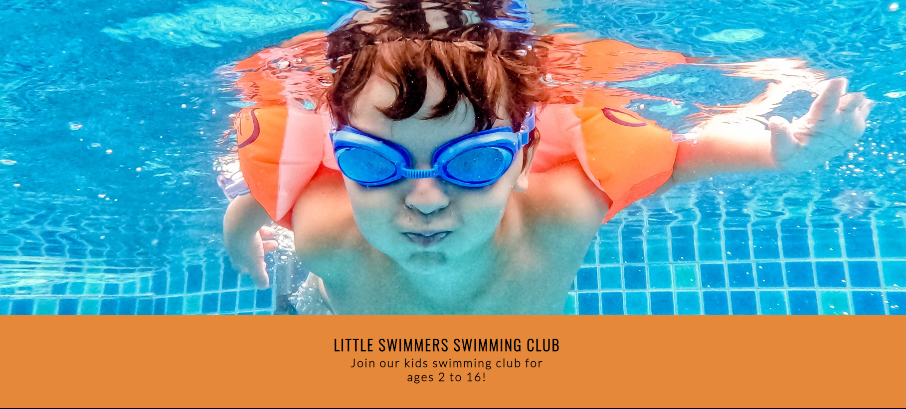

 # Little SWIMMERS SWIMMING CLUB

        Little Swimmers is a swimming club for kids of ages 2 to 16.
        The club offers fun water activities for kids to learn how to swim and gain crucial confidence 
        and water safety skills.
        Users who visit this website will be able to find all the information they need to know about
        the club including a detailed time-table, contact information, links to the clubs social media, 
        an about section and a sign up form.
        
        This website is targeted to the parents of kids who want to learn to swim.

 

 ## Features

 
 ###  Navigation
        
  
  * Featured at the top of the page the navigation shows the club name in the top left corner:
    LITTLE SWIMMERS SWIMMING CLUB which links to the top of the page.

  * The other links in the navigation bar are located on the top right in desktop and tablet form
    these links are linked to the relevant sections of the same page including About Us, Contact Us,
    Sign Up. Please note these links are located under the main header for the page on mobile devices.

  * The navigation has a pseudo class : hover which changes color to make clear to the user that these 
    links make the different sections of the website easily accesible.

  * The navigation is in a color that contrasts with the background.

### The Header
        
  
  * The header has an image of a child swimming which blends well with the color scheme 
    of the website.

  * The header shows the name of the club, it explains what the club is and who it is for.

  * The header explains the club is for 2 to 16 year olds.

  * The header background contrasts with the header text.

        

### The about us section
        
  * The About us section gives the user information about the club
    including what it offers to its members.

  * This section also has a time table clearly stating the schedule
    for each day, time and age group.   

### The sign up section

  * The sign up section has a form for the parent to join their child
    to the swimming club.

  * The form asks for the childs name, the parents name & email address.

  * When the form is submitted the user is redirected to a thank you message
    page with a button which has clear information to link back to the main website. 

### Contact us

  * The contact section provides the user with clear information on how 
    to get in touch with the club.

  * This section displays a phone number, email address and swimming club address.

  * The contact section also provides the user with links to its social media
    platforms which when clicked opens in a new tab.  

        

### Testing

  * I can confirm this website works in different browsers: Edge,Chrome,Safari and 
    Firefox.

  * I can confirm this site is responsive, looks and functions good on all standard
    screen sizes by using dev tools. 

  * I have confirmed the form validation works as it requires entry in all fields
    and will only accept an email in the email field.

  * I have checked the submit button works.

  * I have also checked that the button on the thank you page works and links back to 
    the main website.

### Bugs

     
#### html

  * When validating the html through the official w3c validator I found some bugs
    these errors were from nesting elements inside each other I had one extra closing
    tag for a div in the about section and contact section.

  * I went through the html and removed both said closing tags and ran the html
    through the validator, this time no errors were found.

#### css

  * No bugs were found

#### Accesibility

  * I can confirm that the colors and fonts chosen are easy to read and accessible 
    by running it through Lighthouse in devtools.

  

#### Unfixed Bugs

  * No unfied bugs.

### Deployment
    
    The site was deployed to git hub pages the steps are as follows:

  * In the github repository navigate to the settings tab.

  * Select pages in the drop-down menu.

  * In build and deployment select main then save

  * The page then provided a link to the completed website.  

  Link to live website can be found here -[ Little Swimmers](https://dean85e.github.io/portfolio_project1/) 

### Credits

 * Some inspiration was taken from the Love Running project for the header and navigation bar.

