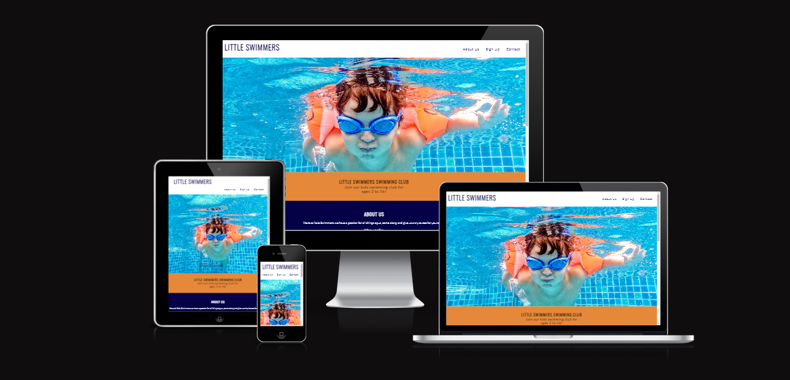
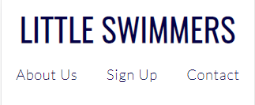
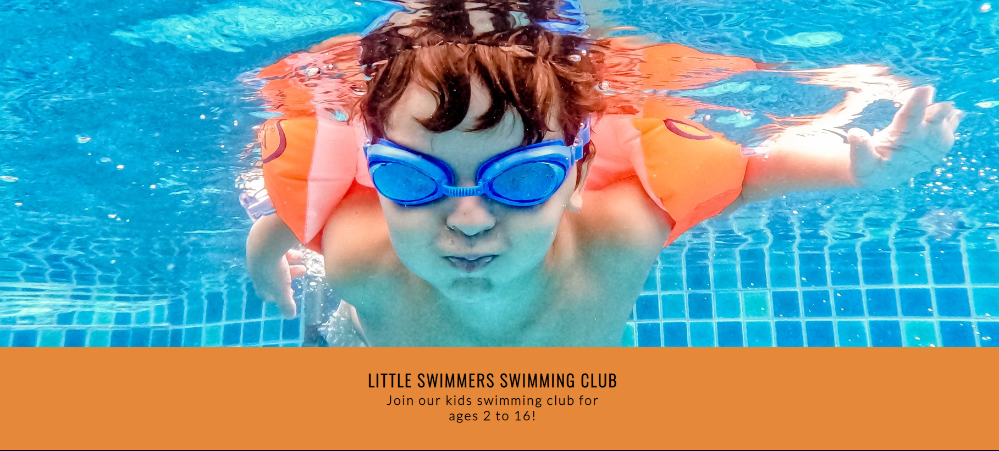
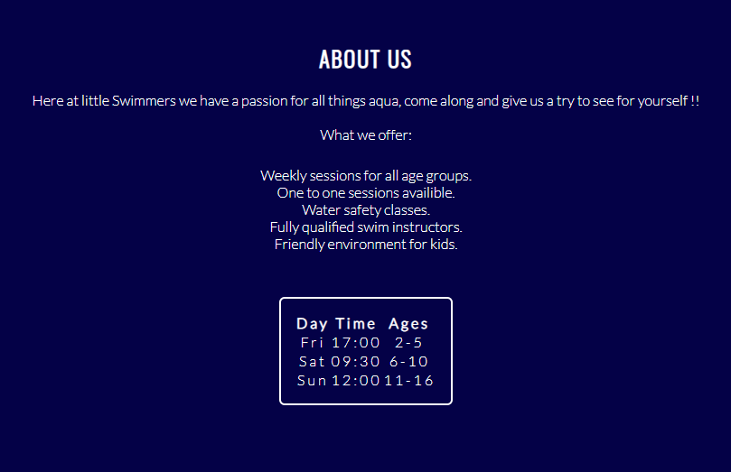
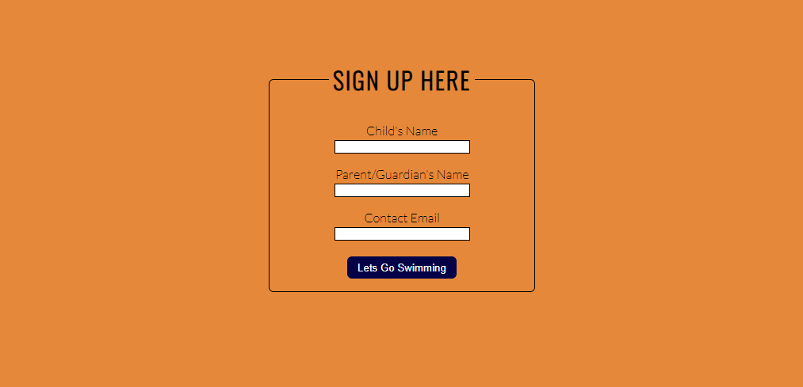
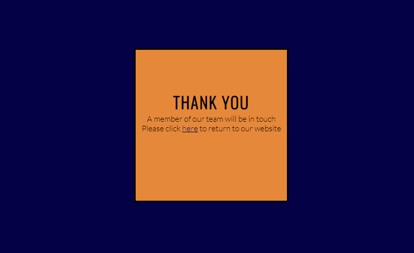
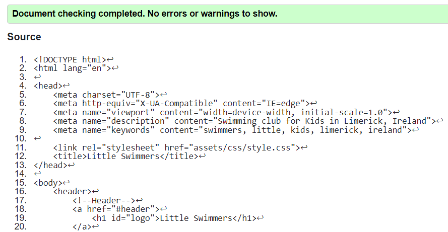
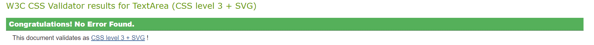
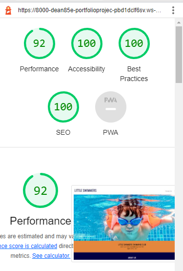

 # LITTLE SWIMMERS SWIMMING CLUB

Link to the live website can be found here -[ Little Swimmers](https://dean85e.github.io/portfolio_project1/) 

Little Swimmers is a swimming club for kids of ages 2 to 16.
This club offers fun water activities for kids to learn how to swim and gain crucial confidence 
and water safety skills.
Users who visit this website will be able to find all the information they need to know about
the club including a detailed time-table, contact information, links to the clubs social media, 
an about section and a sign up form.

## Target Audience

This website is targeted to the parents of kids who want to learn to swim.

 

 ## Live Site

 [ Little Swimmers](https://dean85e.github.io/portfolio_project1/) 

## Repository

https://github.com/Dean85e/portfolio_project1

## UX: User Experience

### User Stories

As a user I want to be able to:

* Understand the purpose of the site on loading.
* Navigate through the site smoothly.
* Be able to contact the club easily.
* Learn information about the clubs offerings an times.
* Be able to connect with the club on social media.

 ## Features

 
 ###  Navigation
        
 
 
  * Featured at the top of the page the navigation shows the club name in the top left corner:
    LITTLE SWIMMERS SWIMMING CLUB which links to the top of the page.

  * The other links in the navigation bar are located on the top right in desktop and tablet form
    these links are linked to the relevant sections of the same page including About Us, Contact Us 
    and Sign Up for a good UX. 
    Please note these links are located under the main header for the page on mobile devices.
    
    

  * The navigation has a pseudo class : hover which changes color to make clear to the user that these 
    links make the different sections of this website easily accesible.

  * The navigation is in a color that contrasts with the background.

  * The fonts used in this site are "Oswald" & "Lato" with a fall back option of "Sans-serif".

  * The two main colors for this website are : 

  * HEX color #E68839, Color name: California.

  * HEX color #040147, Color name: Midnight Blue.

### The Header
        
  
  * The header has an image of a child swimming which blends well with the color scheme 
    of this website.

  * The header shows the name of the club, it explains what the club is and who it is for.

  * The header explains that this club is for 2 to 16 year olds.

  * The header background contrasts with the header text.

        

### The about us section
        
  * The About us section gives the user information about the club
    including what it offers to its members.

  * This section also has a time table clearly stating the schedule
    for each day, time and age group.   

### The sign up section

  * The sign up section has a form for the parent to join their child
    to the swimming club.

  * The form asks for the childs name, the parents name & email address.

  * When the form is submitted the user is redirected to a thank you message
    page with a link which has clear information to link back to the main website. 

### Contact us

  * The contact section provides the user with clear information on how 
    to get in touch with the club.

  * This section displays a phone number, email address and swimming club address.

  * The contact section also provides the user with links to its social media
    platforms which when clicked opens in a new tab for a good UX.  

 

### Future Features

* A hamburger menu for mobile devices.
* A main gallery page.
* Google maps Address with iframes.
* An arrow guiding the user back to the top.

### Testing

  * I can confirm this website works in different browsers: Edge, Chrome, Safari and 
    Firefox.

  * I can confirm this site is responsive, looks and functions good on all standard
    screen sizes by using dev tools. 

  * I have confirmed the form validation works as it requires entry in all fields
    and will only accept an email in the email field.

  * I have checked the submit button works.

  * I have also checked that the link on the thank you page works and links back to 
    the main website.

### Bugs

#### Solved bugs

* When running the site through lighthouse report i noticed the performance score was 
  low (73), To fix this I reduced the size of hero image with Optimizilla's online service 
  this has pushed the sites performance score up to (92).

 
     
#### html

  * When validating the html through the official W3C validator I found some errors
    these errors were from nesting elements inside each other, I had one extra closing
    tag for a div in the about section and the contact section.

  * I went through the html and removed both said closing tags and ran the html
    through the validator again, this time no errors were found.

#### css

  * No errors were found when running this code through the official W3C validator.

#### Accesibility

  * I can confirm that the colors and fonts chosen are easy to read and accessible 
    by running it through Lighthouse in devtools.

  

 
#### Unfixed Bugs

  * No unfixed bugs.

### Deployment
    
  This site was deployed to git hub pages the steps are as follows:

  * In the github repository navigate to the settings tab.

  * Select pages in the drop-down menu.

  * In build and deployment select main then save

  * The page then provided a link to the completed website.  

  Link to the live website can be found here -[ Little Swimmers](https://dean85e.github.io/portfolio_project1/) 

### To Fork The Repository

To make a copy or 'fork' the repository:
   
   1. Log into GitHub and locate repository.
   2. On the right hand side of the page select the 'fork' option to create a copy of the original.

### To Create A Local Clone

  1. Under the repository name, click on the code tab.
  2. In the clone box, HTTPS tab, click ont the clipboard icon.
  3. In your IED open GitBash.
  4. Change the current working directory to the location you want the cloned directory to be made
  5. Type 'git clone' and then paste the url copied from GitHub.
  6. Press enter and the local clone will be created. 

### Credits

 * Some inspiration was taken from the Love Running project for the header  and navigation bar.

 * Some inspiration was also taken from the Love Running project for the social media links in the footer.

   Link to the site -[ Love Running](https://dean85e.github.io/love-running/)

 * Throughout the building process I found many helpful threads online such as :
   
    [Stack Overflow](https://stackoverflow.com)
    
    [W3Schools](https://www.w3schools.com/)
 
 
### Media

 * The photograph for the hero image was taken from pexels.

 * The fonts used in this website were taken from google fonts.

 * The icons used for the social media links were taken from font awesome.

